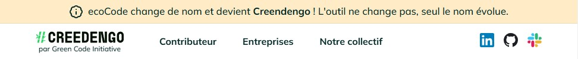
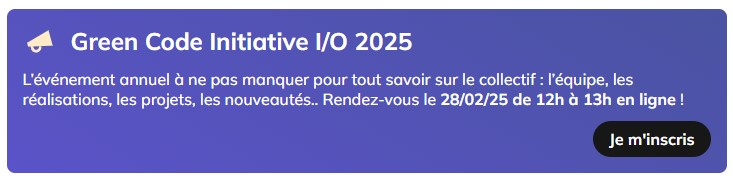

# How to Update Banners

This documentation provides instructions on how to update banners for the website using the `banners.json` file located at `src/assets/data/banners.json`.

## Examples

### Top banner



### Event banner



## File Structure

The `banners.json` file has the following structure:

```json
{
  "top": {
    "enable": false,
    "content": "This banner will be displayed on top of the website."
  },
  "event": {
    "enable": true,
    "title": "Green Code Initiative I/O 2025",
    "content": "It's an awesome event!",
    "action": {
      "label": "I register",
      "link": "https://green-code-initiative.org"
    }
  }
}
```

## Updating Banners

### Top Banner

1. **Enable/Disable the Top Banner**:

   - To enable the top banner, set `"enable": true`.
   - To disable the top banner, set `"enable": false`.

2. **Update the Content**:
   - Modify the `"content"` field with the desired HTML content.

### Event Banner

1. **Enable/Disable the Event Banner**:

   - To enable the event banner, set `"enable": true`.
   - To disable the event banner, set `"enable": false`.

2. **Update the Title**:

   - Modify the `"title"` field with the desired event title.

3. **Update the Content**:

   - Modify the `"content"` field with the desired HTML content.

4. **Update the Action**:
   - Modify the `"label"` field with the desired button label.
   - Modify the `"link"` field with the desired URL.
     You can start the URL with "/" to point out to a route of the GCI website.

By following these instructions, you can easily update the banners displayed on the website.
